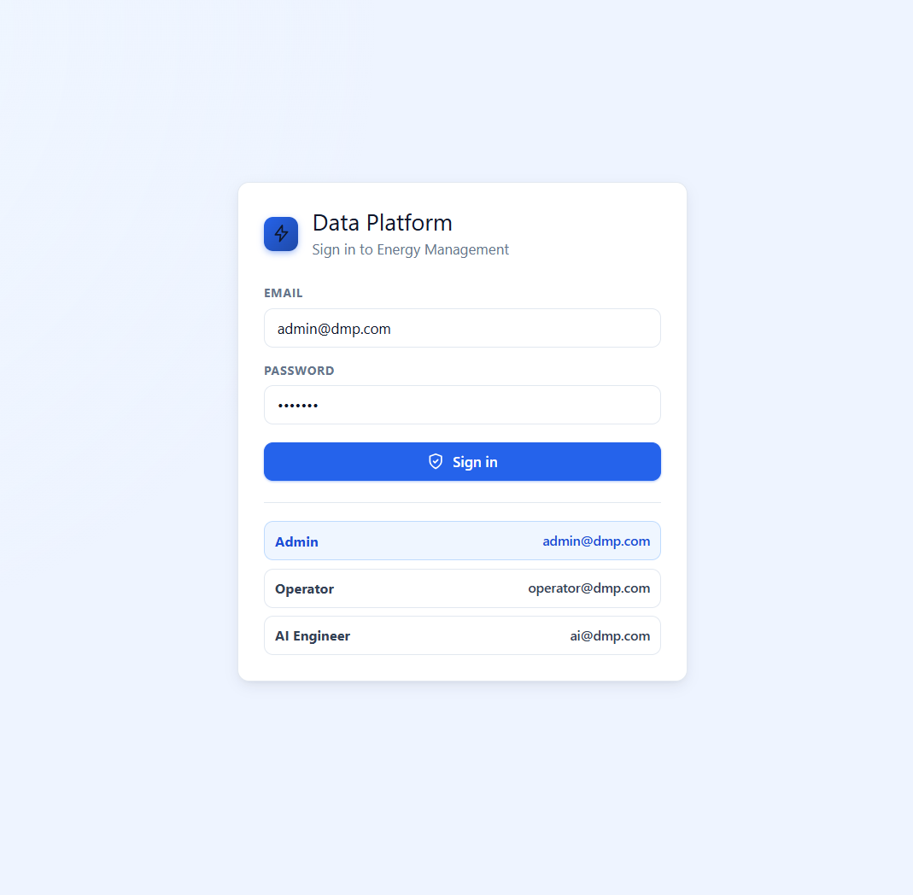
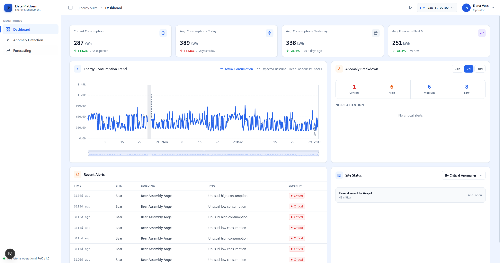
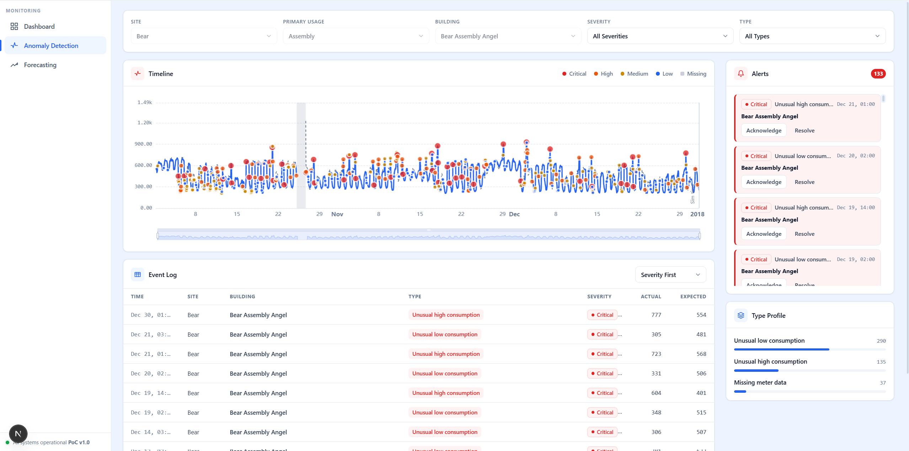
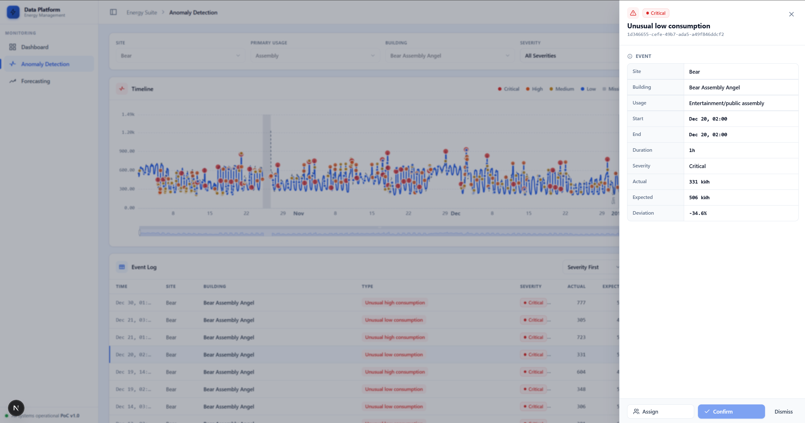
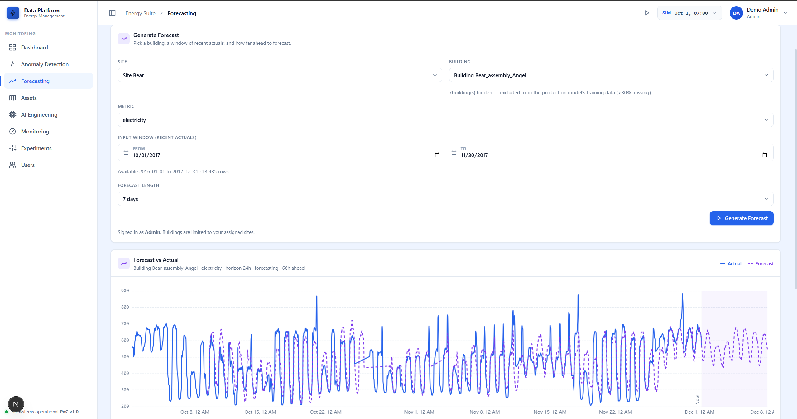
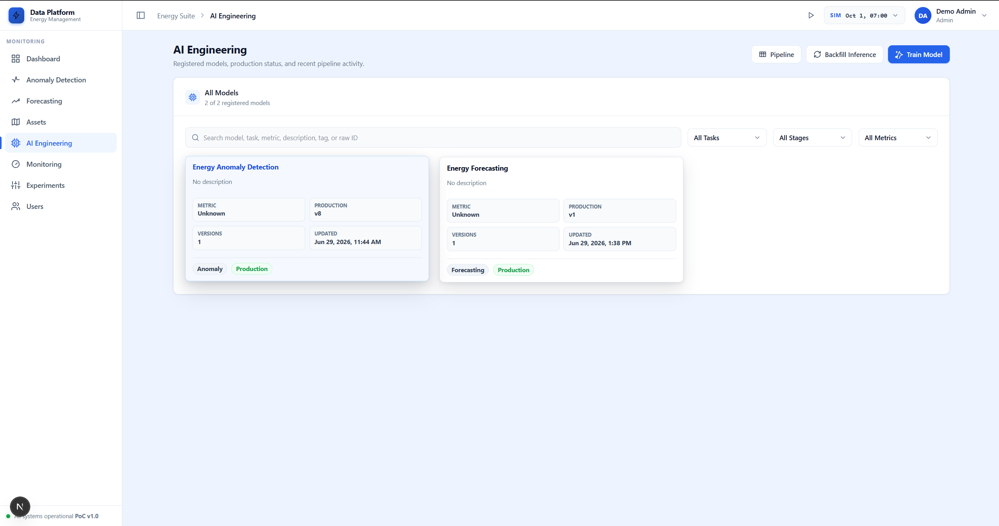
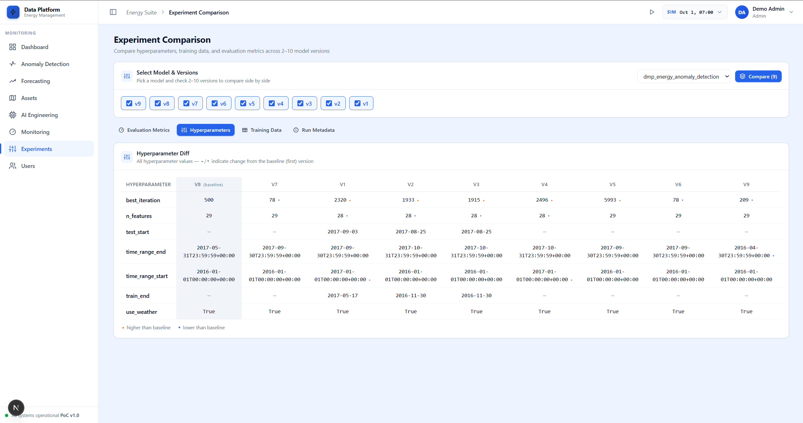
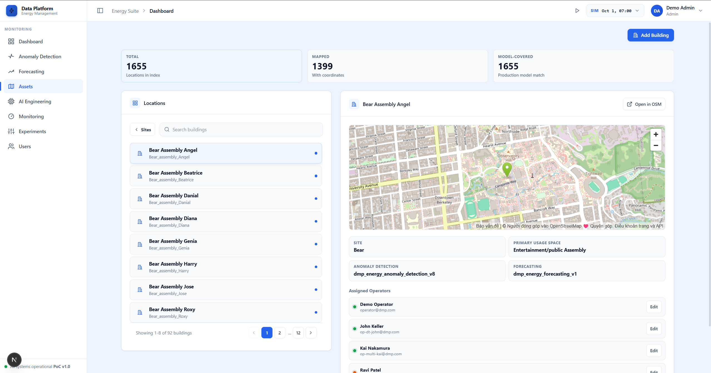
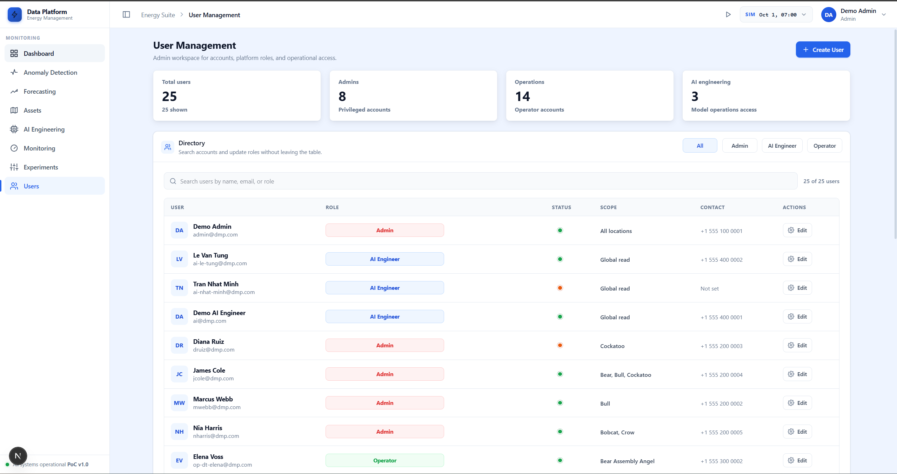
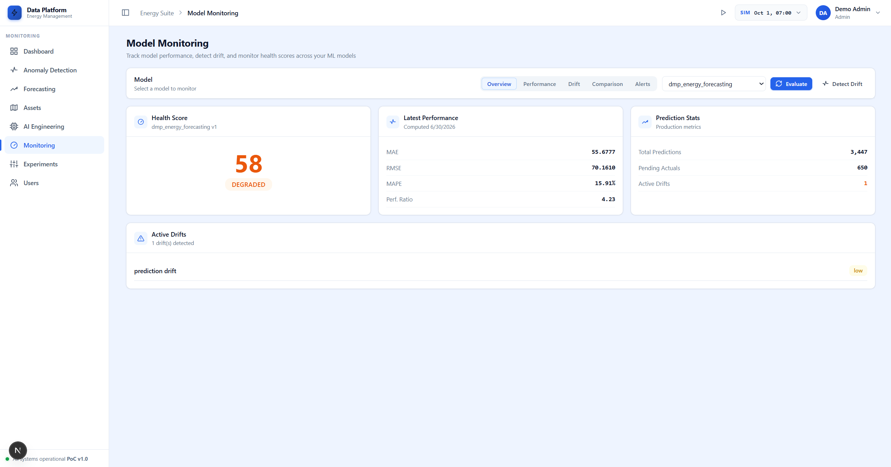

# DMP Smart City AI Platform — User Manual

**Application:** Data Management Platform (DMP) · Energy Management
**Version:** PoC v1.0 · Stack: Next.js + FastAPI + PostgreSQL
**Audience:** All users — Operators, AI Engineers, and Administrators

> **Scope:** The platform currently operates on **electricity consumption telemetry only**. All charts, forecasts, anomalies, and predictions refer to electricity (kWh). Other meter types are not supported.

> **Note on screenshots:** Placeholders marked `![…]` indicate where a screenshot belongs. Capture them from a running instance against each described screen.

---

## Table of Contents

1. [Introduction](#1-introduction)
2. [Getting Started](#2-getting-started)
3. [Daily Operations](#3-daily-operations)
4. [AI Engineering](#4-ai-engineering)
5. [Administration](#5-administration)
6. [Monitoring & System Health](#6-monitoring--system-health)
7. [Troubleshooting & FAQ](#7-troubleshooting--faq)
8. [Glossary](#8-glossary)

---

## 1. Introduction

### 1.1 Objectives

The DMP Smart City AI Platform helps with **monitoring electricity consumption**, **detecting anomalies**, and **forecasting future usage** across many sites and buildings. It combines:

- A live **operations dashboard**.
- An **anomaly detection** workspace for investigating and assigning events.
- **Forecasting** tool that estimate future and expected usage.
- **AI engineering** tools to train, compare, and monitor the machine-learning models that power the above.

### 1.2 Roles

There are three roles. Your role determines which menu items you see and which actions you can perform.

| Role | Purpose |
|------|---------|
| **Operator** | Day-to-day operational access. Monitors and investigates anomalies for the locations assigned to them. |
| **AI Engineer** | Global read access for model training, comparison, and data analysis. Cannot perform operational/administrative actions. |
| **Admin** | Full access. Manages users, assets, and operational data across all locations. |

### 1.3 Permission matrix

| Screen | Operator | AI Engineer | Admin |
|--------|:--------:|:-----------:|:-----:|
| Dashboard | ✅ | ✅ | ✅ |
| Anomaly Detection | ✅ | ✅ | ✅ |
| Forecasting | ✅ | ✅ | ✅ |
| Prediction | ✅ | ✅ | ✅ |
| Assets | — | — | ✅ |
| AI Engineering (Models) | — | ✅ | ✅ |
| Monitoring | — | ✅ | ✅ |
| Experiments | — | ✅ | ✅ |
| Users | — | — | ✅ |
| Settings | ✅ | ✅ | ✅ |

If a menu item is missing from your sidebar, your role does not have access to it.

---

## 2. Getting Started

### 2.1 Accessing the dashboard

Open the platform URL in a modern browser (Chrome, Edge, or Firefox). The default local address is `http://localhost:3001`.

### 2.2 Logging in

1. On the **Sign in** screen, enter your **Email** and **Password**.
2. Click **Sign in**.

For demonstration environments, three seeded accounts are available (password `demo123` for all). Click a role card under the form to fill the email automatically:

| Role | Email | Password |
|------|-------|----------|
| Admin | `admin@dmp.com` | `demo123` |
| Operator | `operator@dmp.com` | `demo123` |
| AI Engineer | `ai@dmp.com` | `demo123` |

> Sessions stay signed in for up to 7 days. After that you will be asked to sign in again.

### 2.3 "Why can't I see a menu item?"

The sidebar is filtered by role (see the [permission matrix](#13-permission-matrix)). For example, **Users** and **Assets** appear only for Admins, and **AI Engineering**, **Monitoring**, and **Experiments** appear only for AI Engineers and Admins. If you believe you need access, contact an administrator.

---

## 3. Daily Operations

These screens are available to all roles and are the core of day-to-day work.

### 3.1 The replay clock

The **Dashboard** and **Anomaly Detection** screens present data as a **replay** over a historical window (the demonstration dataset spans **October–December 2017**). A shared replay clock advances a cursor through time so you can watch consumption and anomalies unfold as they would in a live operations centre. Values such as "current", "today", and "needs attention" are all relative to the clock's current position.

### 3.2 Dashboard

The Dashboard is your at-a-glance operations overview.

**KPI strip (top).** Four key figures for the selected building, in kilowatt-hours (kWh):

| KPI | Meaning |
|-----|---------|
| **Current** | Latest reading vs. the expected baseline. |
| **Today** | Average so far today vs. yesterday. |
| **Yesterday** | Yesterday's average vs. two days ago. |
| **Forecast** | Expected average for the next 6 hours vs. now. |

**Energy Consumption Trend.** A chart comparing **Actual Consumption** (solid line) against the **Expected Baseline** (dashed line). Use the **building picker** in the card header to choose a building; if you are assigned to only one building it is selected automatically.

**Anomaly Breakdown.** A severity summary (**Critical / High / Medium / Low**) for the window you choose with the **24h / 7d / 30d** toggle. The **Needs attention** list shows the top buildings with unresolved critical anomalies — click one to jump straight to the Anomaly Detection screen filtered to that building.

**Recent Alerts.** The most severe recent events (Time, Site, Building, Type, Severity). Click any row to open it in Anomaly Detection.

**Site Status.** A list of buildings with their open/critical anomaly counts. Sort **By Critical Anomalies** or **By Total Anomalies**. Click a row to investigate.

### 3.3 Anomaly Detection

This is the workspace for investigating, assigning, and resolving anomalies.

**Step 1 — Narrow your scope.** Use the filter bar to select, in order:

1. **Site**
2. **Primary Usage** (the building's usage type)
3. **Building**

You can then optionally filter by **Severity** and **Type**. The workspace stays empty until a building is selected. (Operators assigned to a single site/building have these pre-selected and locked.)

**Step 2 — Read the timeline.** The **Timeline** card plots consumption with anomalies coloured by severity (Critical, High, Medium, Low) and gaps marked **Missing**. Click any anomaly marker to open its details.

**Step 3 — Work the Event Log.** Below the timeline, the **Event Log** table lists each anomaly with its Time, Site, Building, Type, Severity, **Actual**, and **Expected** values. Sort by **Severity First**, **Newest First**, or **Oldest First**, and page through results (10 per page). Click a row to open the event.

**Step 4 — Use the side rail.**
- **Alerts** shows open Critical/High alerts with a count badge. From here you can **Acknowledge**, **Resolve**, or **Reopen** an alert.
- **Type Profile** shows the distribution of anomaly types in view.

#### Investigating an event (the drawer)

Clicking an anomaly opens a detail drawer:

It shows the **Site, Building, Usage, Start, End, Duration, Severity, Actual (kWh), Expected (kWh)**, and **Deviation %**. An ongoing event shows its duration "so far".

**To assign someone:**
1. Click **Assign** at the bottom of the drawer.
2. Choose a person from the dropdown.
3. Click **Confirm**.

Use **Dismiss** to close the drawer without changing the assignment.

### 3.4 Forecasting

Forecasting runs the **production forecasting model** to predict future electricity consumption for a building.

1. Choose a **Site** and **Building**. Buildings that the production model cannot serve (more than 30% missing training data) are hidden; a note tells you how many were hidden.
2. The **Metric** is electricity.
3. Set the **Input window (recent actuals)** — a **From**/**To** date range of recent readings the model uses as context. **At least 14 days are required.** The panel shows how much telemetry is available for the building.
4. Choose a **Forecast length**: 1, 2, 3, or 7 days.
5. Click **Generate Forecast**.

The **Forecast vs Actual** chart overlays the actual readings (solid) with the forecast (dashed). Below it you'll see the number of actual and forecast points, and (for AI Engineers and Admins) the model name and run ID. The **Forecast Detail** table lists each future hourly forecast value.

> If you see an error that no production model exists, an AI Engineer must train a forecasting model first (see [§4.2](#42-training-a-model)).

---

## 4. AI Engineering

*Available to AI Engineers and Admins.* These screens manage the machine-learning models behind forecasting, prediction, and anomaly detection.

### 4.1 AI Engineering (Models)

The **AI Engineering** screen lists all registered models with their production status and recent pipeline activity.

- **All Models** is a searchable gallery. Filter by **Task** (Forecasting / Anomaly / Unknown), **Stage** (Production / Non-production), or **Metric**. Each card shows the model's metric, production version, version count, and last-updated time. Click a card to open its detail view.
- Three actions sit in the header: **Pipeline**, **Backfill Inference**, and **Train Model**.

### 4.2 Training a model

1. Click **Train Model**.
2. Choose a **Task** — **Forecasting** or **Anomaly Detection**.
3. Choose a **Data source** — **Cleaned CSV** or **Database**.
4. For forecasting, select exactly one **Metric** (electricity) and optionally a **Forecast horizon** (1–168 hours) and **Weather features** (None / Forecast). Anomaly-detection training runs across all buildings using electricity data.
5. Set a **Date range**. A minimum of **30 days** is required, and the training dataset ends on **2017-09-30** (later end dates are clamped).
6. Review the **validation panel** — it confirms there are enough rows per metric before you can submit.
7. Click **Train Model**. The job is queued and the **Pipeline Activity** view opens.

### 4.3 Pipeline Activity

The **Pipeline** button opens a live list of training runs, each with a status:

| Status | Meaning |
|--------|---------|
| **Queued** | Waiting for a worker to pick up the job. |
| **Running** | A worker is actively executing the job. |
| **Success** | The pipeline completed successfully. |
| **Failed** | The pipeline failed — open details for the terminal log. |
| **Cancelled** | The run was cancelled. |

The list refreshes automatically. Click a run to see its **Run Details**, **MLflow Run ID**, execution time, and full **Terminal Log**. A **Running** job can be stopped with **Cancel Pipeline**.

### 4.4 Backfill Inference

**Backfill Inference** scores anomalies for a historical date range and saves them to the database so they appear in the Anomaly Detection replay. Set a **Date range** (default October–December 2017) and click **Run Backfill**. This requires a production anomaly-detection model.

### 4.5 Experiments

The **Experiment Comparison** screen compares model versions side by side.

1. Select a **Model**.
2. Check **2 to 10 versions**.
3. Click **Compare**.

Results are grouped into four tabs:
- **Evaluation Metrics** — post-deployment metrics side by side.
- **Hyperparameters** — a diff table; ▴/▾ marks changes from the baseline (first) version.
- **Training Data** — dataset footprint per version.
- **Run Metadata** — algorithm, runtime, stage, and MLflow run info.

---

## 5. Administration

*Available to Admins only.*

### 5.1 Assets

The **Assets** screen is the registry of sites and buildings.

- The KPI strip shows **Total** locations, **Mapped** locations (those with coordinates), and **Model-covered** locations.
- Browse **Sites**, then click a site to drill into its **Buildings**. Use the search box to find a location by name or ID.
- Selecting a building opens **Asset Details**: a map (OpenStreetMap), the parent site, primary usage space, the assigned **Anomaly Detection** and **Forecasting** models, and the **Assigned Operators** list.

**To add a building:**
1. Click **Add Building**.
2. Enter a **Building ID**, choose a **Site**, and enter a **Name**.
3. Optionally add **Metadata JSON** (e.g. coordinates).
4. Click **Add Building**.

### 5.2 Users

The **Users** screen manages accounts, roles, and access.

The summary cards show counts of total users, Admins, Operators, and AI Engineers. The **Directory** table lists each user's role, work status, scope (assigned locations), and contact, with an **Edit** action per row. Filter by role or search by name/email.

**To create a user:**
1. Click **Create User**.
2. Enter **Full name**, **Email**, and optionally a **Contact number**.
3. Choose a **Role**:
   - **Admin** — manages users and assets. Enable **Global admin** for cross-site access, or assign specific locations for site-scoped management.
   - **AI Engineer** — read-only global access for model work; no operational actions.
   - **Operator** — assigned to specific locations for monitoring (one site, or multiple buildings from the same site).
4. Set a **Work status** and, for Operators / site-scoped Admins, **Assigned locations**.
5. Set a **Password** meeting all requirements (≥ 8 characters, one uppercase, one lowercase, one number) and **Confirm** it.
6. Click **Create User**.

Use the **Edit** button on any row to change a user's details, role, or locations, or to remove the account.

### 5.3 Settings

Available to everyone via the user menu. Sections:

- **Appearance** — choose a **Light** or **Dark** theme.
- **Account** — your name, email, role, contact number, and access scope (read-only).
- **System** *(Admin only)* — reserved for future platform configuration.
- **About** — application name, version, and technology stack.

---

## 6. Monitoring & System Health

*Available to AI Engineers and Admins.*

### 6.1 In-app Monitoring

The **Monitoring** screen tracks the health of the production model in several tabs (Overview, Performance, Drift, Comparison, Alerts).

The **Overview** tab shows:
- **Health Score** with a status of **HEALTHY**, **DEGRADED**, or **UNHEALTHY**.
- **Latest Performance** — error metrics **MAE**, **RMSE**, **MAPE**, and a **performance ratio**.
- **Prediction Stats** — total predictions, pending actuals, and active drifts.
- **Active Drifts** — a list of any detected drift, with severity, when present.

> If you see "No monitoring data available," trigger a model evaluation to populate the screen.

### 6.2 External dashboards (optional)

When the monitoring services are running, these companion tools are available:

| Tool | URL | Purpose |
|------|-----|---------|
| MLflow | `http://localhost:5000` | Model tracking and run history. |
| Grafana | `http://localhost:3003` | Infrastructure & metrics dashboards. |
| Prometheus | `http://localhost:9090` | Raw metrics. |

A "healthy" system shows services up in Grafana and a healthy model score on the Monitoring screen.

---

## 7. Troubleshooting & FAQ

**A chart or table is empty.**
Make sure you've selected a building (Dashboard, Anomaly Detection) and that your date range overlaps available data. On Anomaly Detection and the Dashboard, remember the data is a replay over **Oct–Dec 2017**.

**"No replay data is available for this building."**
The selected building has no data in the replay window. Choose a different building.

**Forecasting says no production model exists.**
An AI Engineer must train and promote a forecasting model first (see [§4.2](#42-training-a-model)).

**Forecast won't generate / "At least 14 days required."**
Widen the input window so it covers at least 14 days of available actuals.

**I was signed out unexpectedly.**
Sessions expire after 7 days. Sign in again.

**I can't see a screen (Users, Assets, AI Engineering…).**
Those screens are role-restricted. See the [permission matrix](#13-permission-matrix); contact an administrator if you need access.

**Why is there only electricity?**
The platform currently supports electricity consumption only. Other meter types are not available.

**A training run is stuck on "Queued."**
A worker must pick up the job. If it stays queued, a background worker may be down — contact your administrator.

---

## 8. Glossary

| Term | Meaning |
|------|---------|
| **Telemetry** | Recorded electricity consumption readings, in kWh. |
| **Anomaly** | A reading that deviates significantly from the expected baseline. |
| **Severity** | An anomaly's importance: Critical, High, Medium, or Low. |
| **Expected / baseline** | The consumption the model predicted for a given time. |
| **Deviation %** | How far the actual reading differs from expected. |
| **Forecast** | A model's prediction of future consumption. |
| **Forecast horizon** | How far ahead a forecast extends (in hours). |
| **Drift** | A change in data patterns that may degrade model accuracy. |
| **Pipeline run** | One execution of a training or inference job. |
| **Production model** | The model version currently serving live forecasts/predictions. |
| **Backfill** | Scoring anomalies for a past date range and saving them. |
| **MLflow run ID** | The identifier of a model training run in MLflow. |

---

*End of manual.*
